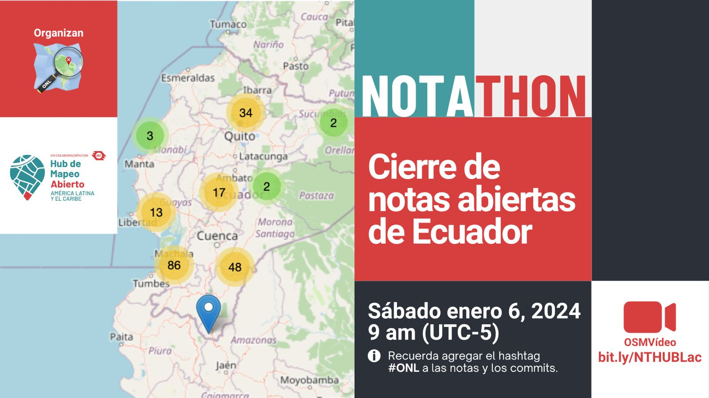

Feliz 2024 a todos!
Nosotros empezamos a calentar motores para todo lo que se viene este año asi que...

Te invitamos a la **notathon** por Ecuador!

Nos encontraremos en el canal de BigBlueButton [https://osmvideo.cloud68.co/user/and-hrh-m5a-trl
](https://osmvideo.cloud68.co/user/and-hrh-m5a-trl) el sábado 6 de enero a las 9 am.

Esta es la lista de notas abiertas en Ecuador: [https://resultmaps.neis-one.org/osm-notes-country?c=Ecuador](https://resultmaps.neis-one.org/osm-notes-country?c=Ecuador)

Recuerda que mediante la resolución de notas se aprende mucho de OpenStreetMap.

Nos vemos el sábado 6 de enero a las 9 am!!
